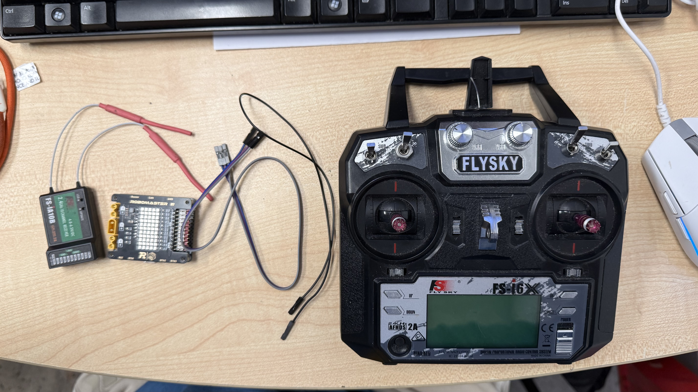
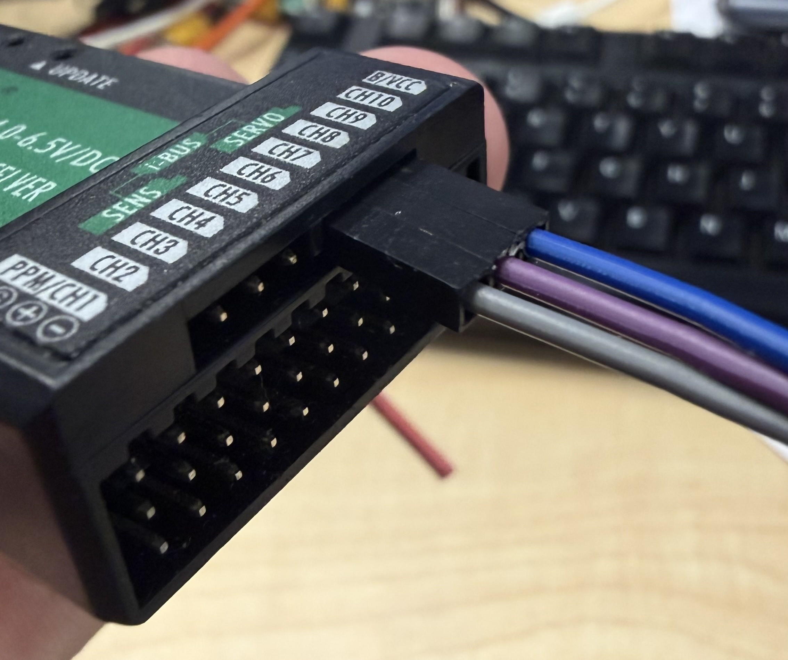
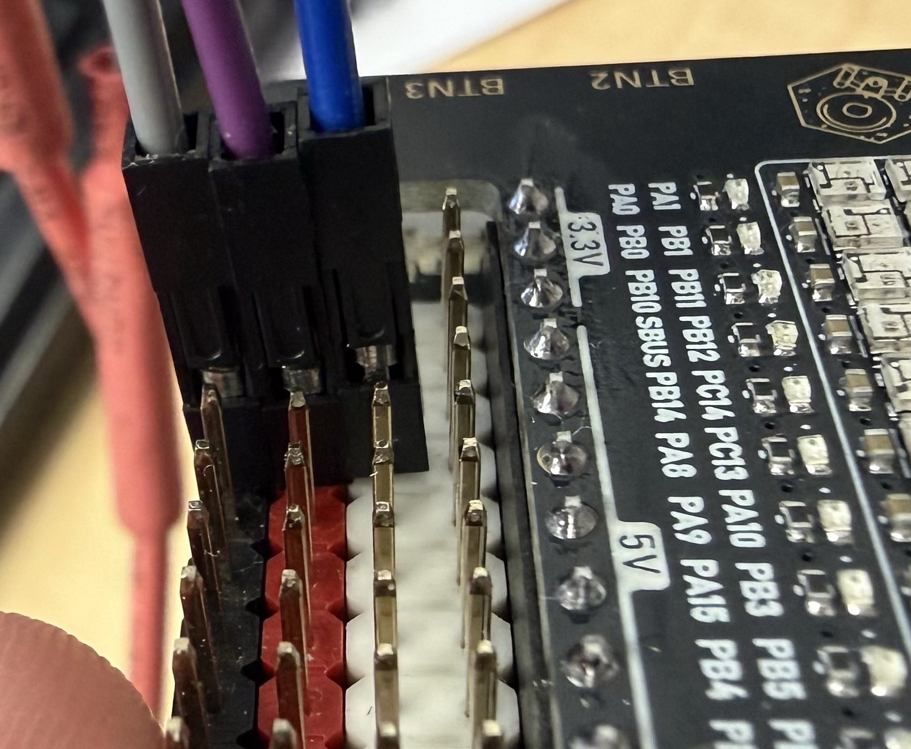
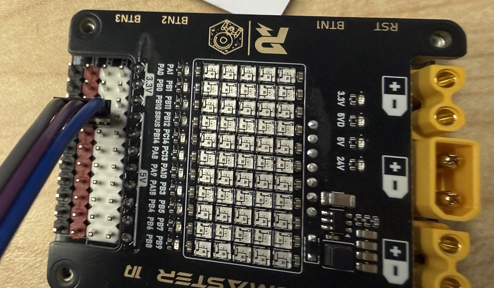
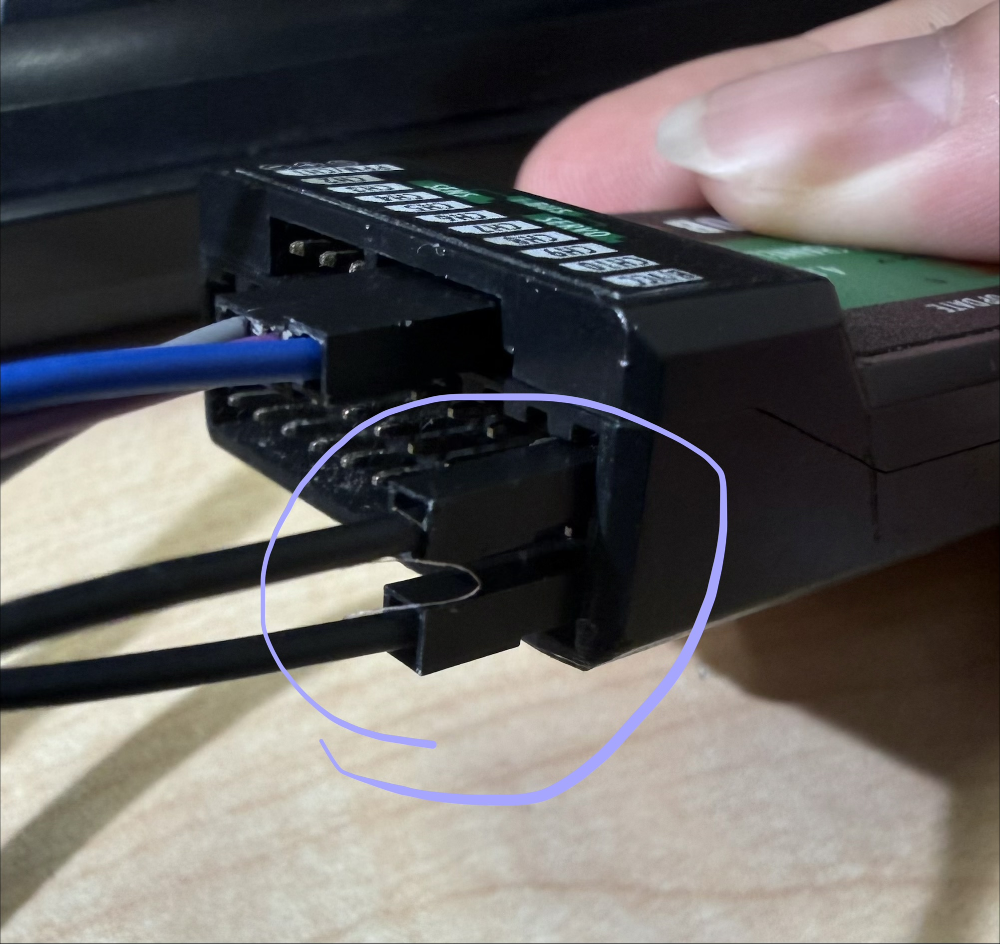
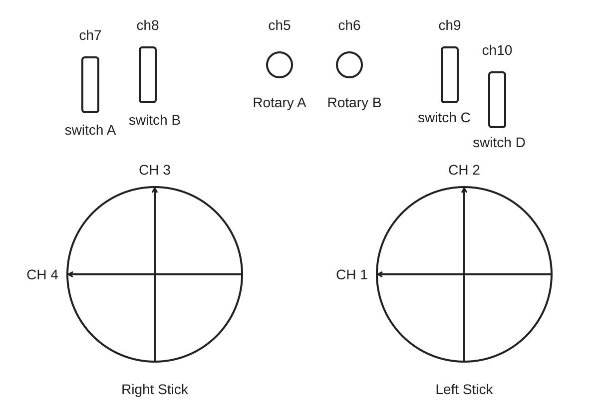

# 作业 1：遥控器与接收机驱动

## 一、器材准备

### 关于 FS-i6X 和 FS-iA10B

在本次作业中，我们总共要用到以下 5 个物品：

1. tutorial 开发板
2. FS-i6X 遥控器
3. FS-iA10B 遥控器接收器
4. 3pin 线（用于将接收器和 tutorial 板连接在一起）
5. 一根杜邦线（用于接收器和遥控器的配对）

*图 1：开发板、遥控器、接收器及连接线。*

## 二、连接接收器和开发板

将 3pin 线的一端连接到接收器，另一端连接到 tutorial 开发板，具体接线如下。

### 接收器端

*图 2：接收器端接线。*

### 开发板端

*图 3：开发板端接线细节。*

*图 4：开发板端接线位置。*

## 三、遥控器与接收器配对

1. 将 tutorial 板断电（拔掉 J-Link、USB 线以及 XT30 的 24 V 供电）。
2. 将接收器和 tutorial 板连接在一起。
3. 按下图所示，用杜邦线短接接收器的配对引脚。

   

   *图 5：接收器短接示意图，圈出位置为杜邦线连接处。*

4. 用电池的 24 V 电给 tutorial 板供电（切勿将 tutorial 板放在金属上），你应当看到接收器上的 LED 灯在快速闪动。
5. 确保遥控器是关闭的，按住遥控器左下角的 Bind Key，打开遥控器。
6. 如果你看到遥控器的显示界面随后同时出现了 TX 和 RX，就代表配对成功了。
7. 拔掉配对的杜邦线，后续不更换遥控器则无需再次对频

> **使用提醒：** 调试过程中，如果长时间不使用遥控器，请及时关闭，避免电池电量过快耗尽。

## 四、SBUS 协议介绍

### 协议与电平逻辑

FS-iA10B 接收的数据使用 SBUS 通信协议。

标准 SBUS 相对普通 UART 的电平逻辑是反相的，即逻辑 0 和逻辑 1 对应的高低电平互换：普通 UART 用低电平表示 0、高电平表示 1，而标准 SBUS 用高电平表示 0、低电平表示 1。因此，通常需要使用串口的 RX 反相功能，或者加入反相电路。STM32F103CBT6 的 USART 硬件不支持 RX 电平反相，无法通过 STM32CubeMX 配置或手动修改寄存器来启用该功能。**我们提供的开发板的 SBUS 引脚已加入反相电路，通过该引脚接入时，无需额外添加反相电路，也无需在软件中配置 RX 反相。在后续 Internal 内部赛中，如果继续使用该芯片接收标准 SBUS 信号，请务必提醒你的硬件队友在 SBUS 信号与 MCU 的 UART RX 引脚之间加入反相电路。**

### 数据格式

#### 数据帧

| 字节 | 内容 |
| --- | --- |
| `Byte[0]` | 帧头（header）：`0x0F` |
| `Byte[1–22]` | 通道 1–16，每个通道占 11 bits |
| `Byte[23]` | 状态标志，见下表 |
| `Byte[24]` | 帧尾（footer） |

#### 状态标志

`Byte[23]` 各标志位：

| 位 | 含义 | 掩码 |
| --- | --- | --- |
| Bit 0 | channel 17（通道 17） | `0x01` |
| Bit 1 | channel 18（通道 18） | `0x02` |
| Bit 2 | frame lost | `0x04` |
| Bit 3 | failsafe activated | `0x08` |

### 通道示意图与数值范围

*图 6：各通道示意图。*

每个通道的最大值为 **1807**，最小值为 **240**。

## 五、作业内容与配置

### 引言

在本次作业中，我们将开发一个驱动程序来处理富斯遥控器与接收机的串口数据。接收器 FS-iA10B 通过 UART 连接到我们的板子，将接收遥控器 FS-i6X 的数据并且将遥控数据通过 UART 传输给主控板。我们的任务是开发一个集成模块，包含接收数据，解码，错误处理等功能。

### 内容

- 使用 STM32CubeMX 配置基础框架，时钟，引脚外设并生成代码
- 使用 VS Code 和 HAL 库函数编写 UART 发送及接收程序
- 熟悉 FS-i6X 遥控器和 FS-iA10B 接收器，按照 SBUS 数据协议框架进行解码
- 将解码后有意义的数据包以 10 Hz 的频率通过 Type-C 串口发送给 PC 串口调试助手
- 利用一些板子上的外设如蜂鸣器，彩灯，数码管进行模块状态的提示（如连接状态，报错等）

### UART 参数

| 参数 | FS-iA10B 接收器 | PC 串口 |
| --- | --- | --- |
| 句柄 | USART3 | USART2 |
| TX 引脚 | — | PA2 |
| RX 引脚 | PB11 | PA3 |
| 波特率 | 100000 位/秒 | 115200 位/秒 |
| 数据位长度 | 9 位（包含奇偶校验） | 8 位（不包含奇偶校验） |
| 奇偶校验 | 偶校验 | 无 |
| 停止位 | 2 | 1 |

### 特别注意

1. 请在 `.ioc` 配置的 **SYS → Debug** 中务必开启 **Serial Wire**。
2. **绝对不要将开发板放在金属表面上（如 Mac 外壳），以免引发短路。**
3. 使用位域结构体解码时，Ozone 调试器可能无法正确显示位域成员的数值。建议另外定义一个成员为普通整数类型的非位域结构体，将解码后的各字段逐一赋值到该结构体中，并在 Ozone 中观察这个非位域结构体，避免将显示异常误判为解码错误

## 六、评分政策

### Basics：100%

| 评分项目 | 占比 |
| --- | ---: |
| 正常接收并解码数据 | 32% |
| 使用中断 | 8% |
| 使用空闲接收 | 5% |
| 使用 DMA 接收数据 | 8% |
| 使用 Callback 解码数据（要求使用中断；如果使用位域则自动获得此项） | 8% |
| 在收到数据的 14 ms 内解码，计算接收频率，接收频率大于 71.4 Hz，且无丢包（须记录遥控器链路完整连接时的频率） | 6% |
| 数据检验和校对 | 7% |
| 通过外设（如 LED）显示 FS-i6X 的连接状态 | 8% |
| 实现遥控器断连（如关机）和接收器断连（如接线松脱）的检测与错误处理；使用同一状态变量表示整条遥控链路是否正常；两种断连恢复后均能自动恢复数据接收与解码，无需重启系统 | 10% |
| 将解码数据按照要求的数据结构通过 USB-C 串口传回本机电脑 | 8% |
| **合计** | **100%** |

### Bonus：15%

| 加分项目 | 占比 |
| --- | ---: |
| 在单独的文件中编写 FS-i6X 驱动程序（不在 `main.c` 中解码） | 10% |
| 使用 Namespace | 5% |
| **合计** | **15%** |

**Bonus 部分仅是提供给完成基础部分并且有兴趣和精力进行更深入的研究方向，仅仅完成 Basics 部分是可以的，或者说你更应该把精力放在完善基础功能要求上。**

## 七、线下 Demo

### Demo 要求

你需要在我们位于 Hall8 的 Lab 进行线下 demo，演示你如何通过 STM32CubeMX 构建你的项目、代码逻辑的原理以及实现效果。我们的 TA 会以此询问相关问题。

### 实验室开放时间

| 日期 | 开放时间 |
| --- | --- |
| 周中 | 每日 18:00–23:00 |
| 周末 | 每日 12:00–24:00 |

如果你想在其他时间来 Lab 进行 demo，请提前通过 WeChat / Discord 联系 TA。否则，我们无法保证实验室有人接待。

**由于我们接收器数量有限，先到先得，请尽早完成并前来 lab 进行 demo，避免临近截止日期由于潜在 demo 高峰期导致未能及时 demo 造成扣分。**

## 八、Demo 截止日期

最终 Demo 截止时间为 **2026 年 10 月 1 日 22:00:00**。请在截止时间前到实验室向我们的 TA 展示效果，并向 TA 确认完成情况。

## 九、备注与参考资料（Remarks）

你可以在“关于 FS-i6X 和 FS-iA10B.pdf”中找到数据结构的详细信息。

一些关于 SBUS 的实用文档（中文版），你可以查阅这些文档，以帮助你理解数据结构。

- [SBUS 参考文档（一）](https://blog.csdn.net/qq_42257666/article/details/119007691)
- [SBUS 参考文档（二）](https://blog.csdn.net/u010168781/article/details/129380783)
