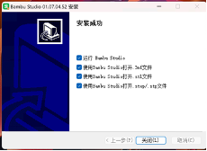
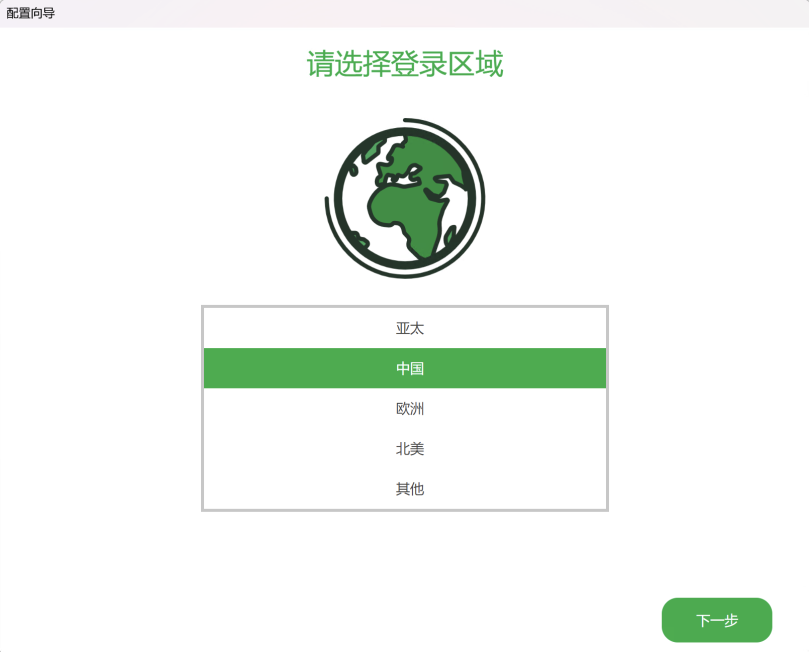
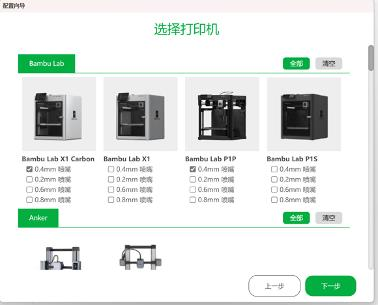
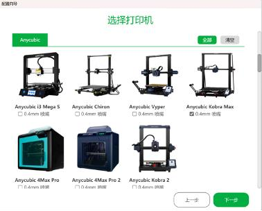
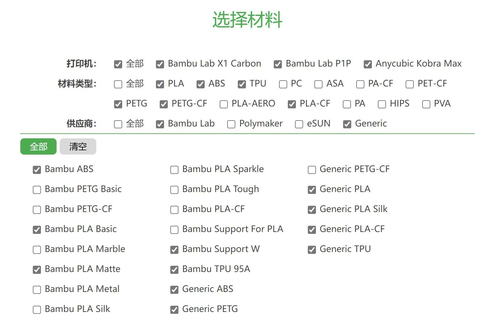

# Bambu Studio 安装指引

> 最后编辑时间：2025.9.19
>
> 编写人：HTL、XJS

本教程介绍 Bambu Studio 的下载、安装和初始配置。

## 1. 下载

Bambu Studio 支持 Windows 和 macOS，用于切片及连接 3D 打印机。

- [Bambu Studio 下载页面](https://bambulab.cn/zh-cn/download/studio)

下载并运行适用于当前操作系统和系统架构的安装包。

## 2. 完成安装

安装完成页面出现文件关联选项时，建议全部勾选，方便直接使用 Bambu Studio 打开 `.3mf`、`.stl` 和 `.step` 等模型文件。

## 3. 初始配置

首次启动时，在登录区域页面选择“中国”，然后进入下一步。

在打印机选择页面勾选：

- Bambu Lab X1 Carbon 0.4 mm
- Bambu Lab P1P 0.4 mm
- Anycubic Kobra Max 0.4 mm

在材料选择页面，按照下图勾选上方的材料类型。下方的材料配置会自动更新。

